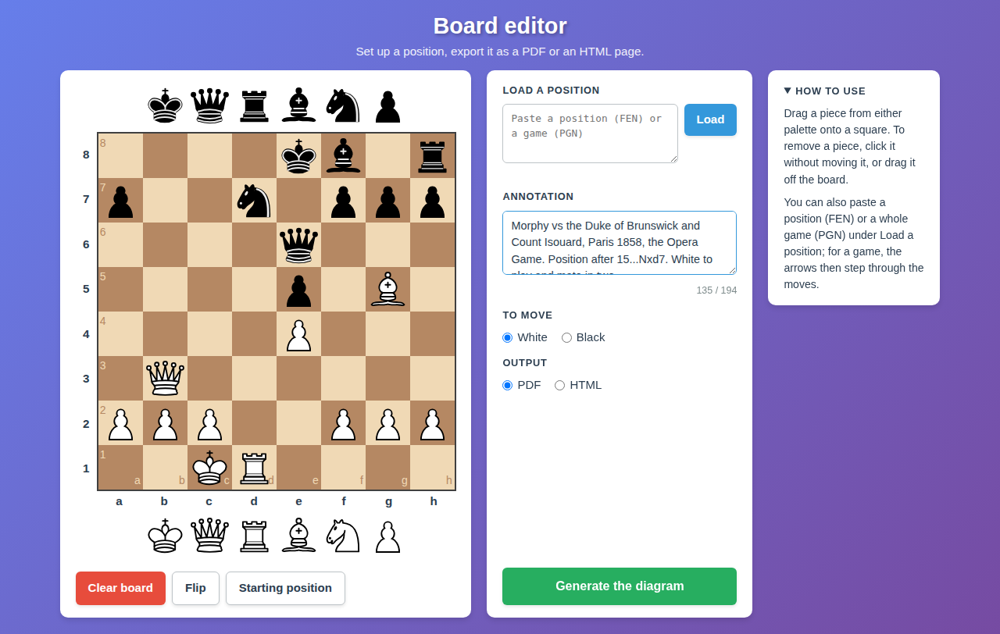
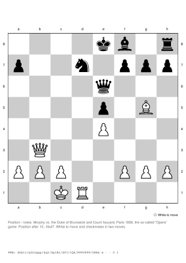

[](https://creativecommons.org/publicdomain/zero/1.0/)


[](https://github.com/deuza/staunton/commits/main)


# Staunton - Chess position diagram generator

Set up a chess position in your browser and get, on the fly, a clean diagram: an A4 PDF ready to print, or a self-contained HTML page to share. Handy for a study sheet or an exercise.

*Any position will do, even an impossible one: five kings on the board is fine.*



Each diagram has 2.4 cm squares, coordinates all around the board, the side to move, a line for your notes and the FEN of the position, so that the position can be set up again from the printed sheet.

An annotated example:

[](images/morphy.png)

More examples, blank and annotated, in HTML and PDF, are in the [images/ directory](https://github.com/deuza/staunton/tree/main/images).

---

## Features

- Drag and drop the pieces from the two palettes, remove them with a click.
- Paste a FEN, or a whole game in PGN (Lichess exports included), then step through the moves to pick the position you want.
- The side to move follows the FEN or the game, and can be changed by hand.
- Options for flipping the chessboard.
- An annotation of up to 194 characters, under the board.
- PDF for printing, HTML for sharing: the HTML page carries everything with it, pieces included, and links to nothing.
- Nothing is stored on the server: no file, no session, no database.
- Works offline: all the browser dependencies are served from the project itself.

---

## Installation

You need PHP 8.0 or later with the `ctype` and `xml` extensions, and TCPDF 6 for the PDF output.
Staunton is tested with PHP 8.0 to 8.5 and TCPDF 6.4.4 to 6.11.4.

### Debian, Ubuntu

```
apt install php-tcpdf php-xml curl
```

### FreeBSD

The instructions below follow the default PHP version of the ports (8.5). On Linux, the test suite passes under PHP 8.5 with TCPDF installed through Composer.

The ports tree has no TCPDF: it is installed with Composer, at the root of the project.

```
pkg install php85 php85-ctype php85-xml php85-zlib php85-curl php85-composer curl
composer require "tecnickcom/tcpdf:^6.9.2"
```

Keep the version constraint: without it, Composer installs TCPDF 7, which Staunton does not support. And keep `php85-curl`: TCPDF 6.8 and later cannot run without the PHP curl extension.

### TCPDF installed elsewhere

Staunton looks for TCPDF in the Debian package first, then in `vendor/` at the root of the project. For any other location, give the path of `tcpdf.php`, or of Composer's `autoload.php`, in the `STAUNTON_TCPDF` environment variable, for instance in the Apache virtual host:

```apache
SetEnv STAUNTON_TCPDF /path/to/tcpdf.php
```

### Browser dependencies

jQuery, chessboard.js, chess.js and the pieces live in the `assets/` directory. If it is missing or damaged, fetch them again:

```
sh fetch-assets.sh
```

The script checks every file against the checksums pinned inside it, and stops at the slightest difference. Keep it next to the code: the test suite reads those checksums, and the server configuration refuses to serve it.

### Web server

The security of an installation rests on two pillars: the code, which protects itself, and the configuration of the web server, which does what the code cannot do. It turns off directory listings, refuses `.git`, `lib/`, `vendor/` and `fetch-assets.sh`, and sends the security headers. That configuration is not optional: apply it before opening the page to others.

With Apache, PHP being enabled through `libapache2-mod-php` or `php-fpm`, from the root of the project:

```
cp docs/apache2/staunton.conf /etc/apache2/conf-available/staunton.conf
a2enmod headers
a2enconf staunton
apache2ctl configtest && systemctl reload apache2
```

The file expects the project in `/var/www/html/staunton`: adjust its paths if needed. Keep `a2enmod headers` first: without that module, `configtest` stops on `Invalid command 'Header'`.

Use `docs/nginx/staunton.conf` with nginx.

[docs/hardening.md](docs/hardening.md) explains every rule of both files, how to hide the version of the server, and how the code protects itself.

### Check the installation

```
php lib/test.php
```

The test suite needs nothing else. It must end with `0 failure(s)`, and it tells which PHP and which TCPDF it found. If `assets/` lacks a file, re-run `fetch-assets.sh`.

Give it the address of the page, and it also checks the configuration of the web server:

```
php lib/test.php http://localhost/staunton/
```

---

## Usage

- Drag a piece from either palette onto a square. To remove a piece, click it without moving it, or drag it off the board.
- To load a position, paste a FEN or a PGN game into the field, then press Enter or click **Load**. Text that cannot be read leaves the board untouched, and the reason is shown below the field.
- After a PGN, four buttons step through the game, and the side to move follows. If the text holds several games, only the first one is read.
- The diagram is drawn from Black's side when the board is flipped on the page, or when Black is to move; from White's side otherwise.
- Type your annotation, check the side to move and the output, then click **Generate the diagram**. The diagram opens in a new tab: the input page stays as it is, ready for another output or another position.

To come back to a position from a printed sheet, copy its FEN into the address of the page, for instance `index.php?fen=8/8/8/4k3/8/8/8/4K3 b - - 0 1`. The side to move is read from the FEN too.

The PDF writes the annotation in Helvetica, which only knows the Western alphabets: Cyrillic, Greek, chess symbols (♔, ♞) or emoji show correctly in the HTML page, but come out as `?` in the PDF.

### Printing the HTML page

The PDF is the one meant for printing. For the HTML page, set the print dialog to default or no margins, without scaling, otherwise the browser shrinks the diagram and the squares no longer measure 2.4 cm.

---

## Example study

The file `images/example-study.pdf` sets a small interesting study.  

At the start, Black has no legal move: four of White's six possible first moves stalemate at once, and only `f3` and `f4` keep the game going.   
White must then checkmate the black king while avoiding stalemate all the way. 

The solution, ready to paste into the page:

```
[SetUp "1"]
[FEN "k7/Pp6/1Pp5/2Pp4/3Pp3/4P3/5P2/6K1 w - - 0 1"]

1.f3 exf3 2.Kf1 f2 3.e4 dxe4 4.Kxf2 e3+ 5.Ke1 e2 6.d5 cxd5 7.Kxe2 d4 8.Kd2 d3
9.c6 bxc6 10.Kxd3 Kb7 11.Kd4 Ka8 12.Kc5 Kb7 13.Kd6 Ka8 14.Kc7 c5 15.b7+ Kxa7
16.b8=Q+ Ka6 17.Qb6# 1-0
```

Note : Only the `[FEN]` tag is required: without it, a PGN starts from the initial position, where `1...exf3` is impossible.    
The `[SetUp "1"]` tag merely flags a set-up starting position; Staunton ignores it, but the PGN standard requires it whenever a `[FEN]` tag is present.   
Keep it so that other software reads the game without trouble.

---

## Files

| File                  | Role                                                  |
|-----------------------|-------------------------------------------------------|
| `index.php`           | input page                                            |
| `generate.php`        | produces the diagram, PDF or HTML                     |
| `app.js`              | drives the board in the browser                       |
| `chess-module.js`     | makes chess.js available to `app.js`                  |
| `style.css`           | styling of the input page                             |
| `favicon.ico`         | icon of the input page                                |
| `lib/chessboard.php`  | geometry of the diagram, checks on what is received   |
| `lib/output-pdf.php`  | PDF output                                            |
| `lib/output-html.php` | HTML output                                           |
| `lib/test.php`        | test suite                                            |
| `lib/.htaccess`       | extra protection of `lib/` under Apache               |
| `fetch-assets.sh`     | fetches the browser dependencies, and checks them     |
| `assets/`             | jQuery, chessboard.js, chess.js, the twelve pieces    |
| `docs/hardening.md`   | security measures and server configuration            |
| `docs/apache2/staunton.conf` | Apache configuration, ready to install         |
| `docs/nginx/staunton.conf`   | nginx configuration, ready to adapt            |
| `images/`             | screenshot and example outputs                        |

---

## Licences

- chessboard.js 1.0.0, Chris Oakman, MIT.
- jQuery 3.7.1, MIT.
- chess.js 1.4.0, Jeff Hlywa, BSD-2-Clause.
- Cburnett pieces, fetched from the lichess repository, CC BY-SA 3.0.
- The rest of the code in this directory is CC0: do whatever you want with it :)

<p align="center">With ❤️ by <a href="https://github.com/deuza">DeuZa</a></p>
